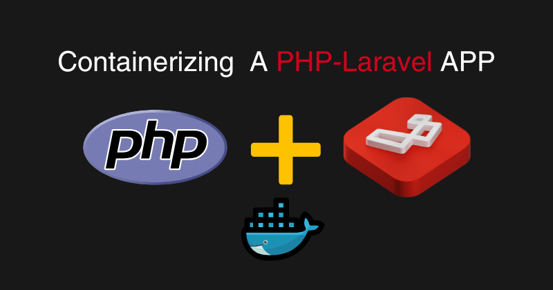

# laravel-dev-docker

A simple and clean Docker setup for running a PHP Laravel application using Nginx and PHP-FPM




## Project Overview

A minimal and clean **Laravel REST API** for managing blog posts, fully containerized using **Docker (PHP-FPM, Nginx, MySQL)**.

This project demonstrates:

- Dockerized Laravel setup
- REST API development
- MySQL integration
- Clean and simple backend architecture

## Features

- Create Blog
- Get Blog
- Update Blog
- Delete Blog
- JSON API responses
- No authentication (for simplicity)
- Docker-based development environment

## Tech Stack

- **Backend:** Laravel 13
- **Language:** PHP 8.4
- **Web Server:** Nginx
- **Database:** MySQL 8
- **Containerization:** Docker & Docker Compose

## Project Structure

```
.
├── docker
│   ├── php
│   │   ├── Dockerfile
│   │   └── entrypoint.sh
│   └── nginx
│       └── default.conf
├── src
│   └── (Laravel application)
├── docker-compose.yml
└── README.md
```

## Setup & Installation

### 1. Clone the repository

```
git clone https://github.com/km-saifullah/laravel-dev-docker.git
cd laravel-dev-docker
```

### 2. Configure Environment

```
cp src/.env.example src/.env
```

Update DB config in `src/.env`:

```
DB_CONNECTION=mysql
DB_HOST=laravel_mysql
DB_PORT=3306
DB_DATABASE=your-database-name
DB_USERNAME=your-database-username
DB_PASSWORD=your-database-password
```

### 3. Generate App Key

```
docker exec -it laravel_app php artisan key:generate
```

### 4. Start Containers

```
docker-compose up --build
```

## Application Access

```
http://localhost:8000
```

## API Documentation

### Base URL

```
http://localhost:8000/api
```

### Create Blog

```
POST /api/blogs
```

```bash
curl -X POST http://localhost:8000/api/blogs \\
-H "Content-Type: application/json" \\
-d '{
  "title": "My Blog",
  "description": "Test blog",
  "image_link": "https://example.com/image.jpg",
  "tags": ["laravel", "docker"]
}'
```

### Get Blog

```
GET /api/blogs/{id}
```

```bash
curl http://localhost:8000/api/blogs/1
```

### Update Blog

```
PUT /api/blogs/{id}
```

```bash
curl -X PUT http://localhost:8000/api/blogs/1 \\
-H "Content-Type: application/json" \\
-d '{
  "title": "Updated Title"
}'
```

### Delete Blog

```
DELETE /api/blogs/{id}
```

```bash
curl -X DELETE http://localhost:8000/api/blogs/1
```

## Blog Model

| Field       | Type      |
| ----------- | --------- |
| title       | string    |
| description | text      |
| image_link  | string    |
| tags        | json      |
| date        | timestamp |

## Useful Commands

### View routes

```
docker exec -it laravel_app php artisan route:list
```

### Run migrations

```
docker exec -it laravel_app php artisan migrate
```

### Clear cache

```
docker exec -it laravel_app php artisan optimize:clear
```

## Common Issues

### 404 Not Found

- Ensure API routes are registered in `bootstrap/app.php`

### 500 Error

- Check `.env` configuration
- Ensure `APP_KEY` is generated

### Database Connection Error

- Verify MySQL container is running
- Check DB credentials

## Future Improvements

- Authentication (JWT / Sanctum)
- Pagination & filtering
- Image upload support
- Redis caching
- Queue system
- Swagger API documentation

## Author

**Khaled Md Saifullah**

GitHub: https://github.com/km-saifullah </br>
LinkedIn: https://linkedin.com/in/kmsaifullah

## License

This project is open-source and available under the [MIT License](LICENSE).
